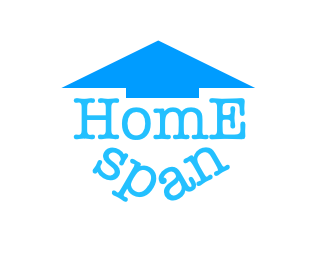

# HomeSpan
*HomeKit for the Arduino-ESP32!*

Welcome to HomeSpan - a robust and extremely easy-to-use Arduino library for creating your own [ESP32-based](https://www.espressif.com/en/products/modules/esp32) HomeKit devices entirely within the [Arduino IDE](http://www.arduino.cc).

HomeSpan provides a microcontroller-focused implementation of [Apple's HomeKit Accessory Protocol Specification Release R2 (HAP-R2)](https://developer.apple.com/support/homekit-accessory-protocol/) designed specifically for the Espressif ESP32 microcontroller running within the Arduino IDE.  HomeSpan pairs directly to HomeKit via your home WiFi network without the need for any external bridges or components.  With HomeSpan you can use the full power of the ESP32's I/O functionality to create custom control software and/or hardware to automatically operate external devices from the Home App on your iPhone, iPad, or Mac, or with Siri.

### HomeSpan Highlights

* Provides a natural, intuitive, and **very** easy-to-use framework
* Utilizes a unique *Service-Centric* approach to creating HomeKit devices
* Takes full advantage of the widely-popular Arduino IDE
* 100% HAP-R2 compliance
* 38 integrated [HomeKit Services](ServiceList.md)
* Operates in either Accessory or Bridge mode

### For the HomeSpan Developer

* Extensive use of the Arduino Serial Monitor
  * Real-time, easy-to-understand diagnostics
  * Complete transparency to every underlying HomeKit action, data request, and data response
  * Command-line interface with a variety of info, debugging, and configuration commands
* Built-in database validation to ensure your configuration meets all HAP requirements
* Integrated PWM functionality supporting pulse-wave-modulation on any ESP32 pin
* Integrated Push Button functionality supporting single, double, and long presses 
* Integrated access to the ESP32's on-chip Remote Control peripheral for easy generation of IR and RF signals
* 16 detailed [tutorial-sketches](Tutorials.md) with extensive comments, HomeSpan documentation and tips and tricks

### For the HomeSpan End-User

* Embedded WiFi Access Point and Web Interface to allow end-users (non-developers) to:
  * Set up Homespan with their own home WiFi Credentials
  * Create their own HomeKit Pairing Setup Code
* Status LED and Control Button to allow end-users to:
  * Force-unpair the device from HomeKit
  * Perform a Factory Reset
  * Launch the WiFi Access Point
* A standalone, detailed [End-User Guide](UserGuide.md)

# Latest Updates

#### 11/3/2020

> HomeSpan 1.0.0 is the initial public release. It is 100% feature-complete and includes 16 very detailed [tutorial-sketches](Tutorials.md) providing step-by-step instructions on how to use HomeSpan to create your own HomeKit devices. A 10-page [User Guide](UserGuide.md) provides addtional details on how to configure your finished HomeKit device for use on your WiFi network, and how to pair it to HomeKit.

# HomeSpan Resources

HomeSpan includes the following documentation:

* [Getting Started with HomeSpan](GettingStarted.md) - setting up the software and acquiring the hardware
* [HomeKit Primer](HomeKitPrimer.md) - a gentle introduction to Apple HomeKit and HAP terminology.
* [HomeSpan Overview](Overview.md) - an overview of the HomeSpan framework
* [HomeSpan Tutorials](Tutorials.md) - a guide to HomeSpan's tutorial-sketches
* [HomeSpan Services and Characteristics](ServiceList.md) - a list of all HAP Services and Characterstics supported by HomeSpan
* [HomeSpan Accessory Categories](Categories.md) - a list of all HAP Accessory Categories defined by HomeSpan
* [HomeSpan Command-Line Interface (CLI)](CLI.md) - use HomeSpan's CLI to configure and monitor your HomeSpan device via the Arduino Serial Monitor
* [HomeSpan End-User Guide](UserGuide.md) - end-user instructions for configuring an already-programmed HomeSpace's WiFi Credentials, creating a device Setup Code, and pairing the device to HomeKit.  No computer needed!
* [HomeSpan Library Reference](Reference.md) - a complete guide to the HomeSpan Library API

### Apple Resources

In addition to the above resources, developers who are new to HomeKit programming should download Apple's [HomeKit Accessory Protocol Specification, Release R2 (HAP-R2)](https://developer.apple.com/support/homekit-accessory-protocol/). The download is free, but Apple requires you to register your Apple ID for access to the document.

You ***do not*** need to read the entire document.  The whole point of HomeSpan is that it implements all the required HAP operations under the hood so you can focus on just programming whatever logic is needed to control your real-world appliances (lights, fans, RF remote controls, etc.) with the device.  However, you will find Chapters 8 and 9 of the HAP guide to be an invaluable reference as it lists and describes all of the Services and Characteristics implemented in HomeSpan, many of which you will routinely utilize in your own HomeSpan sketches.

---

Feedback or Questions? Please send to [homespan@icloud.com](mailto:homespan@icloud.com).

